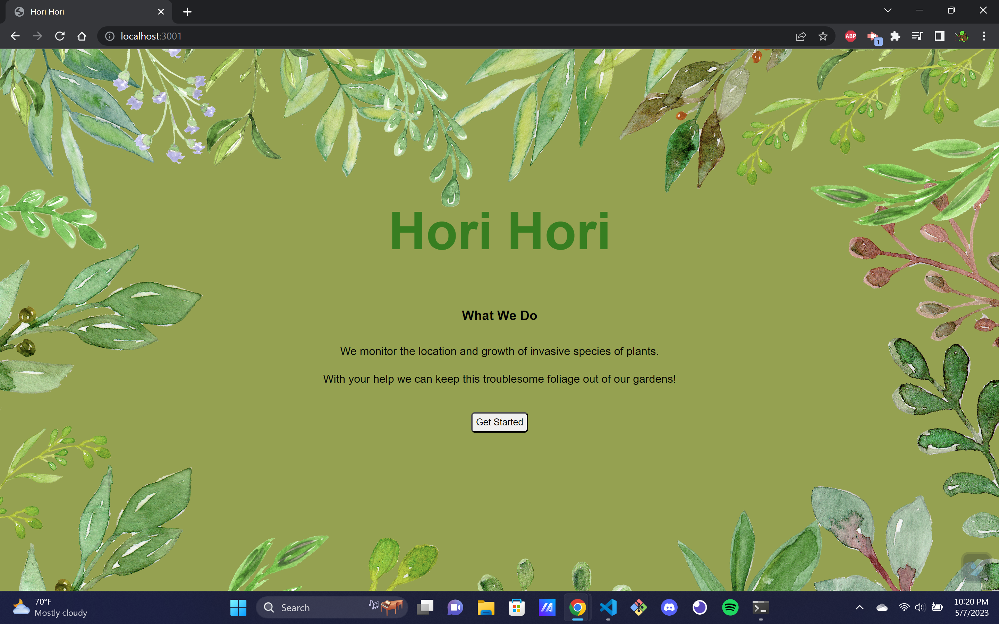
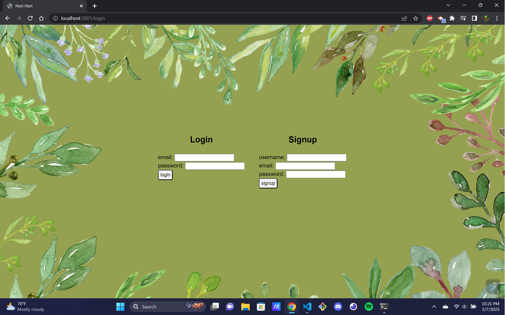
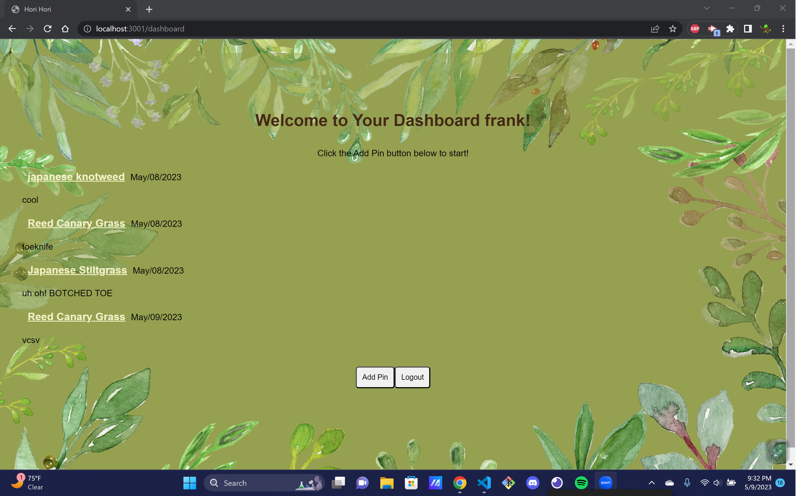

# Hori-Hori
## License

undefined
## Description
Hori-Hori is an application that helps track and manage the spread of invasive plant species. The app uses geolocation to identify and report invasive plants in a user's area.

With this app, users can easily report and share information about invasive plant sightings, which can help local authorities and organizations to take action to control and manage the spread of these plants. The app also provides a database of invasive plant species and information on how to properly identify them, making it easier for users to recognize and report them.

Hori-Hori is a powerful tool for environmental conservation, providing a simple and effective way for individuals to contribute to the protection of natural ecosystems. By tracking and managing the spread of invasive plants, we can help preserve biodiversity and protect our planet for future generations.
    
## Table of Contents
    
- [Installation](#installation)
- [Usage](#usage)
- [Testing](#test)
- [Credits](#credits)
    
## Installation
To install the required dependencies, run the following command:

``` npm install ```

## Usage
use through the web terminal
    
## Testing





## Credits
- 
- plant banner https://www.pngwing.com/en/free-png-bueci/download
    
## Questions
If you have any questions you can contact us at:
- Github https://github.com/PhilRug
- Email ruggiero.pj@gmail.com
- Github https://github.com/gabrielaortiz6